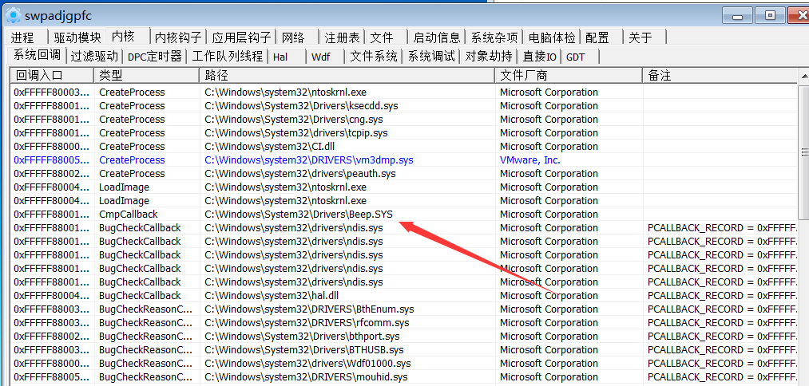

# BOOM

## Introduction

This is a program that uses drivers to read and write to memory. 
It hides itself and changes the way of communication. Not found by ARK tools and game protector

## How Use

see CDrvController.h and Console.cpp

## Build 

IDE:VS2008 - VS2017

WDK: WDK7-WDK10

## snapshot

## support

win7x64 - win10x64